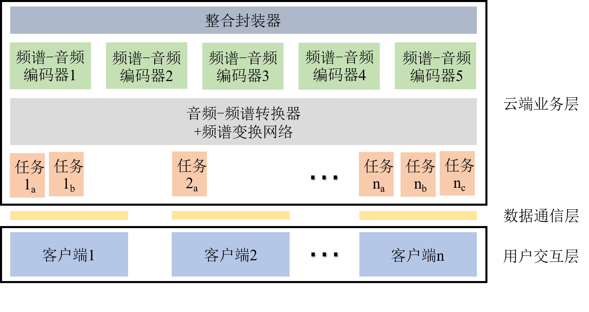
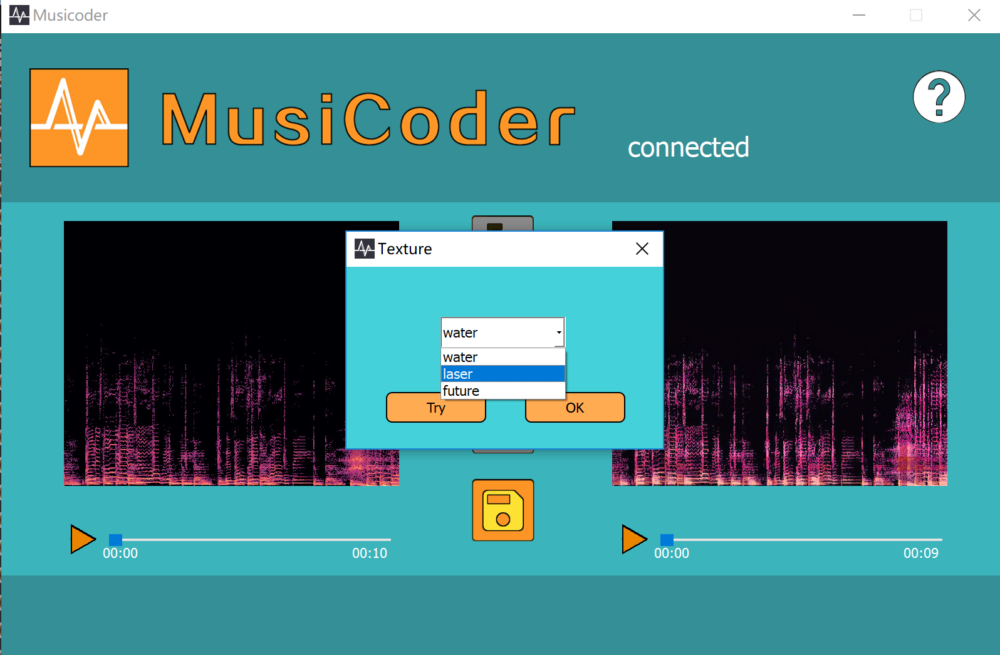

# 基于深度学习的轻量化音乐质感转换系统

[](https://sourceforge.net/projects/musicoder/) [](https://www.codetriage.com/pzoom522/musicoder) [](https://github.com/Pzoom522/Musicoder/wiki)  [](https://github.com/Pzoom522/MusiCoder/blob/master/LICENSE)  [](https://github.com/Pzoom522/MusiCoder/releases)  [](https://github.com/Pzoom522/MusiCoder/issues)  [](http://www.buaa.edu.cn/)  [](https://996.icu)

## :white_flower:项目简介

### 使用方法
- :wrench:下载发行版，请访问[release](https://github.com/Pzoom522/MusiCoder/releases)或[项目页面](https://sourceforge.net/projects/musicoder/)
- :book:软件说明详见[帮助文档](https://github.com/Pzoom522/MusiCoder/wiki)

### 介绍视频

<p align="center"><a href="https://www.bilibili.com/video/av22386731/" target="_blank"></a></p>


### 功能简介
> 像给照片选取滤镜一样，自由地改变自己喜欢的音乐的风格与流派
- :musical_note:基于深度学习算法，改变歌曲的质感(已经完成封装，可以直接调用)；
- :cloud:经过裁剪与优化的模型，可部署在低配置云服务器上，并借助我们的通讯组件与客户端实现相应交互式应用；
- :bulb:轻量级跨平台客户端，资源占用更少，操作逻辑更简，输出时间更短，服务更具想象力。

### 整体架构

<p align="center"></p>

---------
## :small_red_triangle_down:MusiCoder-服务器端
### 算法数据流

<p align="center"></p>

### 配置及环境要求
#### 基本配置
- Ubuntu 12.04 LTS 及以上
- 内存4G及以上 (推荐)
- Python 3 环境

#### 所需主要依赖
- 科学计算与数据可视化：[matplotlib](https://matplotlib.org/)+[scipy](https://scipy.github.io)(numpy/pylab/etc)
- 图形图像：[PIL.Image](https://pillow.readthedocs.io)
- 音频处理：[librosa](https://librosa.github.io)+[pydub](https://github.com/jiaaro/pydub/)+[ffmpeg](https://ffmpeg.org)(配置为环境变量)

### 模型文件
__请分别解压并放置在 _converter/models_ 下__

[未来感音效](https://github.com/Pzoom522/MusiCoder/blob/master/doc/audio/future_10.mp3?raw=true)|[水流音效](https://github.com/Pzoom522/MusiCoder/blob/master/doc/audio/water_10.mp3?raw=true)|[镭射音效](https://github.com/Pzoom522/MusiCoder/blob/master/doc/audio/laser_10.mp3?raw=true)
:-: | :-: | :-:
[future.ckpt](https://www.dropbox.com/s/6xhg6ipsn0fq7yy/future.ckpt.zip?dl=0)|[water.ckpt](https://www.dropbox.com/s/y2rstqwq21xph99/water.ckpt.zip?dl=0)|[laser.ckpt](https://www.dropbox.com/s/wln82c3c6ibhbfx/laser.ckpt.zip?dl=0)
|| 

### 运行
 1. 开放端口 ___[port]___
 2. 执行命令，运行程序（后台静默模式）```nohup python3 server.py [port] &```

### 性能预估
在配置为双核Intel® Xeon® CPU E5-26xx v4 CPU和4G内存的设备上，极限负载为同时承受约20个客户端的峰值任务。
在正常连接情况下，服务器端程序应当可以对各类情况做出正确反馈。但是在客户端中途掉线时，可能会导致 ___temp___ 目录下出现残留文件，建议定时进行清除。

## :small_red_triangle:MusiCoder-客户端

<p align="center"></p>

### 配置要求
- 较新的Window系统。4G内存及以上。
- 暂无特殊环境要求。如果发现，请在[issue](https://github.com/Pzoom522/MusiCoder/issues)中提出。

### 数据传输信息
此次客户端发行版本所连接的服务器[ip:端口]为[140.143.62.99:2333]
此服务器性能较差（__双核cup，4G内存__）。如果想部署自己的服务，请针对服务器进行重新配置。具体的调整详见[帮助文档](https://github.com/Pzoom522/MusiCoder/wiki/2.0-Requirements-&-Installation#%E5%AE%89%E8%A3%85%E9%83%A8%E7%BD%B2)
### 安装及运行说明
直接启动对应版本的安装包即可安装。安装完成后，联网条件下启动，进行使用。


## :round_pushpin:TODO
- [ ] 改善客户端交互
- [ ] 提升后台速度(我们需要更好的服务器。欢迎投喂比特币
:moneybag:到[1JyMBHSvReQYvoUDAKaKo9amABcLRqsjsq]())
- [ ] 发行OSX、Linux版本
- [ ] 修复出现的bug
- [ ] 开源训练代码

## :link:References
Please cite us and give a :star: if you found this repo useful:

> X. Peng, C. Li, Z. Cai, F. Shi, Y. Liu, and J. Li. _[A Lightweight Music Texture Transfer System](https://arxiv.org/abs/1810.01248)_. CoRR __abs/1810.01248__ (2018)
